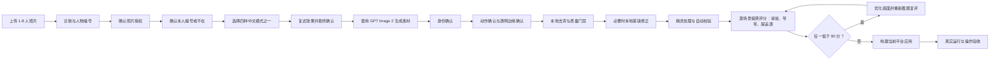

# Love Roommate / 爱室友

把合照里的室友、同事或朋友变成会在桌面上爬、跟着鼠标移动、偶尔挑战人际关系承受能力的跨平台桌宠。

`Love Roommate` 是一个面向 **Codex Desktop** 的方法型 Skill：它负责诊断照片、让用户认领自己、提供行为模式、指导生成素材、检查效果并构建应用。仓库本身不包含任何人的照片或生成角色图。

Skill 面向任意 1–8 人的随机合照：人数和本人位置来自用户确认，不固定为五人，也不默认“中间的人”就是本人。下文的五人对话仅是示例。用户不用设计角色顺序；Skill 会根据“本人是否在照片里”自动安排跪喊和屎追逐。

> **友情风险提示**
>
> 如果你还没毕业，建议先给友情买份保险。保险可能赔电脑，但大概率不赔友尽。
>
> 使用后可能出现：宿舍气氛短暂凝固、群聊消息连续撤回、室友要求你连夜卸载，以及一句非常真诚的“你到底每天在学什么”。
>
> 段子归段子，照片里的人必须知情并同意。不要偷拍，不要拿它骚扰别人，也不要把别人的隐私当测试数据。

## 推荐环境

- **推荐使用 Codex Desktop**：Skill 会复用 Codex 自带的 Node、pnpm、Python、Sharp 和图像生成能力，不需要用户自己搭一套开发环境。
- **运行桌宠建议**：Windows 10/11 x64 或 Apple Silicon macOS、至少 8 GB 内存，并给透明窗口合成留出余量。发布验收同时保留五窗口回归并覆盖最终八窗口候选；机器正处于高负载或显卡驱动异常时，实际占用仍会变化，因此不承诺所有硬件永不卡顿。
- **最终人物素材推荐并按流程要求使用 GPT Image 2**：身份板、每人身份母版，以及逐动作或左右成对动作素材都会记录 `codex-imagegen / gpt-image-2 / workflow-attested` 声明和文件哈希。
- 这份声明用于防止流程误操作，不是 OpenAI 平台签名，也不能抵抗恶意手工伪造。PNG 不会随身携带一张“我是哪个模型画的”公证书。
- 首次构建需要联网下载固定版本的 Electron 41.0.2；脚本会校验官方压缩包哈希和运行时结构。

## 它能做什么

| 用户看到的模式 | 效果 |
| --- | --- |
| 普通桌宠 | 所有照片人物在桌面自由活动，支持拖拽、暂停和托盘菜单。 |
| 集体跪喊 | 有本人时，本人站立不跪，其他角色全部跪下喊爸爸或爷爷；明确回复本人不在照片里时，全员跪下喊爸爸或爷爷。两个分支都优先居中单排，屏幕放不下时才使用不重叠多排。 |
| 屎追逐 | 有本人时，本人是唯一且持续的拉屎者，其他角色轮流冲上去追吃、吃完归队，角色身份不交换；本人不在照片时，鼠标控制一坨点击穿透的屎，所有角色组成不断链的人形蜈蚣追着它爬。 |
| 全部都要 | 同时提供普通桌宠、集体跪喊和自适应屎追逐，由托盘或快捷键切换特殊恶搞。 |

内部实现使用 `normal / group-shout / poop-chase / all`，并根据本人是否在照片中自动派生追逐变体；这些内部键不会拿来考用户。

无论选择哪种模式，真实系统鼠标都保持可见和可用；装饰效果不会抢走正常点击。

## 性能与控制

- 运行目标固定为 30 fps。Windows 发布门禁要求活动场景帧间隔 p95 不高于 50 ms，场景切换之外不得出现超过 150 ms 的长停顿；平均总 CPU 不高于 10%，启动到全部窗口可见不高于 5 秒。
- 5 窗口内存门禁使用 Electron 主进程、renderer、GPU 与 utility 进程的 **total private bytes**，上限 500 MB；10 分钟 soak 的 private bytes 增长不高于 50 MB。跨 Chromium 进程求和的 working set 仅作为诊断值，因为共享页会被重复计入。
- 运行时使用一个共享 ticker；Pause 后 ticker updates/s 不高于 idle 的 25%，并跳过动画、窗口移动和状态广播。人物窗口只在坐标改变时更新 bounds，只在可见动作状态改变时发送 IPC；便便效果窗口按需创建，生产默认关闭性能采样日志。
- 托盘菜单提供 **Pause / 暂停** 与 **Quit / 退出**，快捷键仍由生成项目的 `behaviors.json` 配置。当前版本保持清晰的固定 30 fps，没有伪造一个会偷偷降画质或删动作的“性能模式”；需要立即释放动画负载时请使用 Pause，需要彻底释放资源时请使用 Quit。
- 最终 Windows 包必须通过 `scripts/run_performance_audit.mjs` 生成完整报告，再由构建门禁校验新鲜 fingerprint、全部阶段、阈值和隐私字段；缺失、过期或失败报告都会阻断发布。

## 安装

### 推荐：让 Codex 安装

在 Codex 中输入：

```text
使用 $skill-installer，以 ZIP/download 模式从 GitHub 仓库 zhoutian1995/love-roommate 的根目录安装 Skill，安装名设为 love-roommate，并使用发布页标明的稳定标签作为 --ref。
```

安装完成后，新建一个 Codex 任务或重启 Codex，使 `$love-roommate` 出现在可用 Skill 列表中。

### 高级安装：直接运行 Skill Installer 脚本

普通用户不需要执行这一节。仅在你明确需要脚本化安装、并且本机已经有可用 Python 时使用。

Windows PowerShell：

```powershell
$ref = "v1.1.0"
python "$HOME\.codex\skills\.system\skill-installer\scripts\install-skill-from-github.py" --repo zhoutian1995/love-roommate --path . --name love-roommate --method download --ref $ref
```

macOS：

```bash
REF="v1.1.0"
python3 "$HOME/.codex/skills/.system/skill-installer/scripts/install-skill-from-github.py" --repo zhoutian1995/love-roommate --path . --name love-roommate --method download --ref "$REF"
```

需要复现一次验收或审计时，应固定到发布证据中的 **精确 SHA**，不要使用会移动的分支名：

```powershell
$ref = "<exact-commit-sha>" # 替换为 40 位精确 SHA
python "$HOME\.codex\skills\.system\skill-installer\scripts\install-skill-from-github.py" --repo zhoutian1995/love-roommate --path . --name love-roommate --method download --ref $ref
```

仓库根目录安装必须使用上面的 ZIP/download 模式。不要对仓库根目录使用 `--method git --path .`：当前 Skill Installer 会把临时 clone 的 `.git` 一并复制，结果不是干净、可逐文件核验的 Skill 安装。

### 开发者安装：使用 Git

普通用户不需要安装 Git。这个方式适合需要查看源码、参与开发或调试安装过程的人；它会保留 `.git`，属于源码工作副本，不是上面的干净 Skill 安装。

Windows PowerShell：

```powershell
git clone https://github.com/zhoutian1995/love-roommate.git "$HOME\.codex\skills\love-roommate"
```

macOS：

```bash
git clone https://github.com/zhoutian1995/love-roommate.git "$HOME/.codex/skills/love-roommate"
```

如果目标目录已经存在，安装器会停止，不会替你表演“覆盖后假装什么都没发生”。

## 快速开始

上传一张包含 1-8 个人的照片，然后告诉 Codex：

```text
使用 $love-roommate 处理这张合照。
```

其余步骤由 Skill 按 **上传照片 → 授权 → 本人 → 模式 → 最终确认** 的固定顺序，用中文一次只问一个问题；用户不需要记住内部参数或一次填写表单。

这里的规则必须说死：**没回答本人是谁，不等于本人不在。只有用户明确回复“不在”，才能进入无本人分支。** Skill 只能继续追问这一项，不能擅自代选。

一人照片且本人是唯一人物时，集体跪喊和屎追逐整体安全跳过，只保留普通桌宠；最终确认必须明确告诉用户，不得让用户误以为仍会出现本人独自拉屎的场景。一人照片但用户明确本人不在时，全员跪喊和鼠标屎追逐仍然可用。

用户也可以一次说完：`照片里的人都同意，我是3号，全部都要。` 无本人分支可以说：`照片里的人都同意，我不在照片里，全部都要。` Skill 会复用已经有效的答案，只追问缺失项。

首轮仍然必须先完成照片诊断和人物编号，然后只询问下一个缺失项。用户已经说明“照片里的人都同意”时，不得重复询问授权；如果授权、本人和模式都已经说明，编号后直接复述最终效果并请求确认。

四种模式的完整文字意思：

- `普通桌宠`：所有照片人物在桌面自由活动，可拖拽、暂停和退出。
- `集体跪喊`：有本人时本人站着不跪，其余全员排队跪下，分拍喊“爸爸”“爷爷”；本人不在时，全员排队跪下喊“爸爸”“爷爷”，不虚构站立接收者。两个分支都优先自动排成居中单排，屏幕放不下时才使用不重叠、不裁切的居中多排。
- `屎追逐（有本人）`：本人是唯一且持续拉屎的人，其余全员轮流追吃，吃完归队，身份永不交换。
- `屎追逐（本人不在）`：鼠标控制一坨点击穿透的屎，照片里全员首尾连接成人形蜈蚣追着爬。
- `全部都要`：包含普通桌宠、集体跪喊和与本人状态对应的屎追逐，可在运行时切换。

`集体跪喊`是一个用户选项，但实际会播放并分别验收“爸爸喊”和“爷爷喊”两个独立场景，不需要用户再选一次口号。`全部都要`因此包含四个可见场景：普通桌宠、爸爸喊、爷爷喊，以及与本人状态对应的屎追逐。

用户确认模式后，制作与验收流程是：**身份确认 → 动作确认 → 逐模式搞笑评分 → 构建与真实运行验收**。爸爸喊、爷爷喊和当前屎追逐变体必须分别达到 90 分；低于 90 分就继续改画面、重拍和复评。

Skill 会按下面的流程推进：



## 透明恢复与失败边界

- **远程图像生成**：获得授权的参考照片会发送给当前 Codex 图像生成服务，用于生成身份母版和动作素材。这一步需要联网，具体数据处理还受所使用服务的条款约束。
- **本地去背**：生成结果的键色识别、透明处理、清边、像素统计和质量门禁都在本机完成，不会为了去背再把图片发送给其他云服务。
- 每个身份母版最多三次自动尝试；每次必须采用未用过的高对比键色，并重新通过身份一致性和透明质量检查，不允许无限重试。
- 三次仍无法自动通过时，Skill 才会在 `127.0.0.1` 的随机端口打开无第三方依赖的**本地蒙版修正**页面。它只提供“擦除背景”和“恢复人物”，不上传修正图片，也不会覆盖原始候选文件。
- 本地页面使用随机会话令牌，保存后生成版本化 PNG、蒙版与 SHA-256 修正报告；取消、超时或保存结束后服务立即关闭。
- 修正后仍必须重新走清边、统计、原分辨率视觉检查和 self-check。如果背景色已经混入头发、皮肤或衣服内部，或者人物被侵蚀，流程必须**失败关闭**并要求换照片或重新生成，不能把瑕疵素材伪装成通过。
- 如果内置键色路线和本地蒙版都无法解决头发、鞋带等区域的烘焙色边，可在用户**显式授权**后选择真透明 fallback：通过 CLI 使用 `gpt-image-1.5` 原生透明 PNG。此可选路径需要用户在本机设置 `OPENAI_API_KEY`，不会成为默认流程，也不会静默切换模型；生成结果仍须逐图视觉门禁、登记和 self-check。

### 实际对话示例（五人仅为示例）

```text
Codex：这张照片可以用，我识别到 5 个人。
       1号：黄色上衣、浅蓝牛仔裤
       2号：绿色连帽衫、黑色裤子
       3号：紫色上衣、白色裤子
       4号：蓝色外套、棕色裤子
       5号：红色外套、深色裤子

       先确认一件事：照片里的人都知道并同意制作桌宠吗？
用户：是。

Codex：你是照片里的几号？不在照片里就回复“不在”。
用户：3号。

Codex：想做哪种桌宠？回复数字就行：
       1 普通桌宠
       2 集体跪喊
       3 屎追逐
       4 全部都要
用户：4。

Codex：我记好了：你是3号；叫爸爸/爷爷时，3号站在前面，1、2、4、5号全部跪下喊；
       屎追逐时，3号持续拉，1、2、4、5号全部追着吃；选择“全部都要”。
       确认无误后，我再开始生成。
用户：确认。
```

关键规则：

1. Skill 不会偷偷判断照片里哪一个是你，必须由你回复具体编号或“不在”。完整提问顺序就是授权、本人、中文模式和最终确认，不再追加恶搞排除、领头人或接力顺序。
2. 创建项目前必须明确确认照片中所有人已授权；系统只能记录你的声明，不能替你去宿舍挨个做法律尽调。
3. 有本人时，本人是站立的“被膜拜者”，不会跪、不会喊、不会显示对应气泡；其他角色全部跪喊。屎追逐里本人持续拉，其他角色全部追吃，吃的人不会反过来成为拉的人。
4. 本人不在照片时，不虚构一个“主人”：爸爸/爷爷模式全员跪喊；屎追逐由鼠标控制点击穿透的屎，全员组成人形蜈蚣追随。
5. 跪喊参与者在空间足够时居中单排；空间不足时自动组成不重叠、不裁切的居中多排。有本人时本人站在队列正前方中心轴；无本人时整队居中。
6. 第一次确认检查脸、发型、衣服、编号、本人和模式；第二次确认检查动作、完整身体和透明边缘。
7. 运行阶段会检查鼠标跟随、队形连接、“全程只有一坨”、本人是否始终是拉屎来源，以及爸爸/爷爷是否按本人存在状态正确分配全员。这不是哲学原则，是自动化测试。
8. 最终构建会直接启动复制后的 `.exe` 或 `.app` 做 packaged smoke，再对包含发布物的整个输出目录执行第二次隐私扫描。

## 搞笑程度人工门禁

技术正确不等于好笑。每个被选中的特殊恶搞都必须打开当前场景的完整运行画面，由 Codex 自己分别打分、写出扣分原因并继续优化；不能把“等用户看看再说”当验收。选择“全部都要”时，爸爸喊、爷爷喊和当前屎追逐变体是三份独立审核，不能平均或共用一个总分。

| 评分维度 | 分值 | 看什么 |
| --- | ---: | --- |
| 角色关系 | 25 | 谁是本人、谁跪、谁拉、谁追吃能否一眼看懂 |
| 荒诞程度 | 20 | 梗是否直接、有反差，但没有乱堆效果 |
| 动作与节奏 | 20 | 集合、跪下、喊话、拉和追吃是否有清晰节拍 |
| 队形表现 | 15 | 跪喊是否整齐、蜈蚣是否不断链、追逐是否明确 |
| 屎的可读性 | 10 | 是否看得清又不遮脸、不夸张成巨大贴纸 |
| 回看欲 | 10 | 是否有递进、时机感或值得再看一次的笑点 |

以下情况不允许靠其它维度补分，必须直接返工重拍：

- 有本人时，本人与跪拜队的可见距离超过一个人物身高，画面像组织结构图而不是现场跪拜，判失败并返工。
- 爸爸喊和爷爷喊如果只是换文字、换颜色，没有姿态或节奏升级，判失败并返工。
- 追吃高潮里，吃的人嘴部没有接触或碰到屎的边缘，只靠“啊呜”气泡解释，判失败并返工；屎也不能覆盖整张脸。
- 无本人屎追逐里，人形蜈蚣出现断链、人物各自排队爬或有人脱队，判失败并返工。

任一特殊恶搞总分低于 90 就是整体不通过。爸爸喊、爷爷喊以及当前启用的屎追逐变体必须分别达到 90 分，不能取平均分，也不能用另一个模式的高分补齐。每份评分必须绑定当前场景截图，六项严格求和，并填写有意义的扣分、具体优化和重新截图后的复评；对象、布尔值、空白或零宽字符会被拒绝。评分权重、阈值和必填字段通过稳定序列化进入 runtime fingerprint，契约变化后旧审核自动失效。普通桌宠模式不要求搞笑评分。该门禁与 self-check 技术分、隐私审计和性能门禁并列，任何一项失败都不能构建交付版。

## 隐私原则

- 参考照片仅在远程图像生成阶段发送给当前图像生成工具，用于生成用户自己的角色素材；本地去背、本地蒙版修正、审计与构建不再上传图片。
- 原图不会复制进 `project/`、`release/` 或 `preview/`，Manifest V2 也不持久化原图 SHA-256、大小、创建时间或本机绝对路径。
- 当用户传入 `--source` 时，原图哈希只在内存中临时用于精确副本检查，不写入项目。
- 用户生成的身份板、动作表、角色精灵和预览图保存在用户自己的输出目录，不进入本 Skill 仓库。
- 项目中的位图实行严格白名单：只允许精灵清单引用的已处理图片，额外塞进去的“顺手备份一下原图”会被拒绝。
- 对外发布前必须审计整个输出根目录；`project/`、`release/` 和 `preview/` 中都不得包含原始照片的精确副本，包括通过符号链接引用的副本。
- `release/` 只有在审计通过后才适合分享；`project/` 含处理后的肖像精灵，默认不公开，取得明确许可后再分享；`preview/` 含身份板、动作表和运行截图，默认只留在本机。
- 不要直接压缩分享整个输出根目录。那不是发布包，是把后台、化妆间和监控录像一起端上桌。
- 请只使用已获得许可的照片。技术上能生成，不等于社交上能活着回来。

## 输出结构

```text
<name>-desktop-pet/
├── project/   # 可编辑 Electron 项目、配置和处理后的精灵
├── release/   # 当前操作系统的构建产物
└── preview/   # 身份板、动作总览、运行截图和场景报告
```

默认只分享审计通过的 `release/`。`project/` 与 `preview/` 都包含更接近人物素材和制作过程的内容，应留在本机，除非照片中的所有人明确同意公开。

## 平台支持

| 平台 | 输出 |
| --- | --- |
| Windows x64 | 包含命名 `.exe` 的便携文件夹 |
| Apple Silicon macOS | 本机 ad-hoc 签名并通过严格签名校验的 arm64 `.app` |

当前不承诺 Linux 或 Intel Mac 构建。macOS 应用只做本机 ad-hoc 签名，不包含 Developer ID 签名或 Apple 公证；首次打开仍可能需要通过 Finder 的“打开”或系统安全设置确认。

## 常见问题

### 为什么没有直接开始生成？

因为先诊断、再选人物和模式是硬性流程。直接生成很快，但把室友顺序搞错以后，解释起来通常更慢。

### 可以使用其他图像模型吗？

可以拿来讨论提示词，但本 Skill 的最终身份板、每人身份母版，以及逐动作或左右成对动作素材按 GPT Image 2 工作流执行。生成清单记录固定策略和文件哈希，用来发现漏记录或文件被改动；它不是密码学模型证明，README 不在这里表演“看一眼 PNG 就知道祖宗十八代”。

### 旧项目为什么突然不能构建？

Manifest V1 可能保存原图指纹或本机路径，因此不会被静默放行。先运行 `migrate_project_manifest.mjs --dry-run` 查看变化，再用 `--apply --consent confirmed` 显式迁移。没有确认，就不替你半夜改户口本。

### 网络受限时会自动切第三方镜像吗？

不会。默认只使用官方 npm registry 和 Electron 官方发布源。第三方源必须同时显式设置镜像地址与 `CODEX_ALLOW_THIRD_PARTY_MIRROR=1`，并显示安全警告；“下载失败所以悄悄换源”已经退休。

### 为什么第一次自检会失败？

这是设计行为。第一次运行会生成待人工检查文件并返回非零状态，防止 Codex 在没看图片时自己给自己颁发满分证书。

### 为什么屎追逐里只能看到一坨？

因为画面要让人一眼看懂谁在拉、谁在追，不是开批发市场。测试会确保每个采样帧最多只有一坨，并验证它确实位于拉的人与追吃队伍之间，或跟随真实鼠标。

### 屎追逐会跟随鼠标吗？

本人不在照片时会：点击穿透的屎跟随真实鼠标，全员人形蜈蚣追它。本人在照片时，鼠标带着本人角色移动，本人持续拉，其他角色全员追吃。构建阶段会生成场景报告和完整窗口截图验证实际位移。

## 开发与验证

发布负责人应同时逐项填写 [发布证据模板](docs/release-evidence-template.md)，并使用 [发布检查清单](docs/发布检查清单.md) 做最终独立复核。旧 commit、开发模式运行、单一人数测试或只看 JSON 的结论，都不能证明当前候选可以发布。

在仓库根目录运行：

```powershell
node --test assets/electron-template/tests/behavior-engine.test.mjs assets/electron-template/tests/performance-v2.test.mjs assets/electron-template/tests/config.test.mjs assets/electron-template/tests/security.test.mjs
node --test scripts/tests/security-hardening.test.mjs scripts/tests/runtime-security.test.mjs scripts/tests/release-policy.test.mjs
node --test scripts/tests/portrait-chroma.test.mjs scripts/tests/transparency-repair.test.mjs scripts/tests/transparency-repair-security.test.mjs scripts/tests/mask-editor-contract.test.mjs scripts/tests/transparency-retry.test.mjs
node scripts/run_performance_audit.mjs --project <project> --executable <packaged-executable>
node scripts/release_check.mjs
node scripts/audit_skill_release.mjs
python -X utf8 "$HOME\.codex\skills\.system\skill-creator\scripts\quick_validate.py" .
```

Windows 上显式使用 `-X utf8`，避免系统默认 GBK 时官方校验器读取中文 `SKILL.md` 失败；这只改变文本解码方式，不跳过任何校验。

发布前必须满足：

- 行为测试全部通过。
- 隐私审计不包含任何人物位图或生成目录。
- Skill 官方校验通过。
- 用户项目 self-check 状态为 `pass`，技术总分不低于 90；每个启用的特殊恶搞人工搞笑分同时不得低于 90。
- 人工实际打开身份板、动作总览和运行场景图，而不是对着 JSON 发挥想象力。

## 免责声明

本项目用于已获授权照片的创意桌宠制作与技术实验。使用者自行负责取得肖像与隐私许可，并对生成内容、传播范围和人际后果负责。

作者提供代码、方法和校验工具，不提供友情修复、宿舍调解或保险理赔服务。
## 八窗口 Windows 性能发布门禁

五人只是兼容性回归样例，用户照片实际支持随机 1～8 人。正式发布前必须在真实 Windows 环境对同一发布候选完成两次 packaged 性能审计：一次五窗口回归，一次最终八窗口压力候选。两次都要直接启动打包后的 `.exe`，不得用开发模式、合成报告或缩减人物代替。

```powershell
node scripts/run_performance_audit.mjs --project <五人项目> --executable <五窗口打包目录\Love Roommate.exe> --report <五窗口报告.json>
node scripts/run_performance_audit.mjs --project <八人项目> --executable <八窗口打包目录\Love Roommate.exe> --report <八窗口报告.json>
node scripts/validate_performance_release.mjs --five-project <五人项目> --five-report <五窗口报告.json> --five-executable <五窗口.exe> --five-packaged-root <五窗口resources\app> --eight-project <八人项目> --eight-report <八窗口报告.json> --eight-executable <八窗口.exe> --eight-packaged-root <八窗口resources\app>
```

每个活动阶段、十分钟 soak 和 Pause 都必须逐秒记录全部人物窗口的 id、`isVisible` 与 `isDestroyed`；只在启动时曾经显示过不算通过，任一阶段中途少窗、隐藏或销毁都会触发 `pet-window-coverage`。报告必须分别包含准确的 `expectedWindowCount: 5` / `windowCount: 5` 和 `expectedWindowCount: 8` / `windowCount: 8`。字段缺失、人数不符、报告过期、运行 fingerprint、候选代码 fingerprint 或 `.exe` SHA-256 不匹配时一律阻断发布。

当前性能报告契约为 **schema 4**：它在旧版运行 fingerprint 之外，强制加入候选代码 fingerprint、按配置顺序排列的 `expectedPetIds`，以及每个阶段的逐样本窗口可见性证据。Schema 3 报告不包含这些发布必需证据，必须视为过期并拒绝使用；性能 fingerprint 元数据版本仍独立保持为 3。

最终八窗口构建还必须带 `--release-performance-gate`，并通过 `--five-performance-project`、`--five-performance-report`、`--five-performance-executable`、`--five-performance-packaged-root` 提供五窗口回归证据；构建脚本会机械调用 5+8 聚合校验。八窗口使用与五窗口完全相同的 CPU、帧时间、启动时间、内存、十分钟 soak 和 Pause 阈值，不能为了通过而放宽阈值、减少动作、删除人物或取消慢移排队效果。发布证据只保存脱敏后的相对路径、报告 SHA-256 和结论，不得包含用户照片或本机绝对路径。
