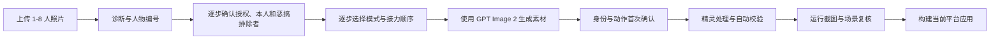

# Love Roommate / 爱室友

把合照里的室友、同事或朋友变成会在桌面上爬、跟着鼠标移动、偶尔挑战人际关系承受能力的跨平台桌宠。

`Love Roommate` 是一个面向 **Codex Desktop** 的方法型 Skill：它负责诊断照片、让用户认领自己、提供行为模式、指导生成素材、检查效果并构建应用。仓库本身不包含任何人的照片或生成角色图。

> **友情风险提示**
>
> 如果你还没毕业，建议先给友情买份保险。保险可能赔电脑，但大概率不赔友尽。
>
> 使用后可能出现：宿舍气氛短暂凝固、群聊消息连续撤回、室友要求你连夜卸载，以及一句非常真诚的“你到底每天在学什么”。
>
> 段子归段子，照片里的人必须知情并同意。不要偷拍，不要拿它骚扰别人，也不要把别人的隐私当测试数据。

## 推荐环境

- **推荐使用 Codex Desktop**：Skill 会复用 Codex 自带的 Node、pnpm、Python、Sharp 和图像生成能力，不需要用户自己搭一套开发环境。
- **运行桌宠建议**：Windows 10/11 x64 或 Apple Silicon macOS、至少 8 GB 内存，并给透明窗口合成留出余量。验收数据针对最终 5 窗口包；人物更多、机器正处于高负载或显卡驱动异常时，实际占用会变化，因此不承诺所有硬件永不卡顿。
- **最终人物素材推荐并按流程要求使用 GPT Image 2**：身份板、每人身份母版，以及逐动作或左右成对动作素材都会记录 `codex-imagegen / gpt-image-2 / workflow-attested` 声明和文件哈希。
- 这份声明用于防止流程误操作，不是 OpenAI 平台签名，也不能抵抗恶意手工伪造。PNG 不会随身携带一张“我是哪个模型画的”公证书。
- 首次构建需要联网下载固定版本的 Electron 41.0.2；脚本会校验官方压缩包哈希和运行时结构。

## 它能做什么

| 模式 | 配置值 | 效果 |
| --- | --- | --- |
| 普通桌宠 | `normal` | 人物在桌面自由移动，支持拖拽、暂停、托盘菜单和恶作剧效果。 |
| 人体蜈蚣 | `centipede` | 所有人按透明精灵锚点连接，并跟随鼠标移动。友情从这里开始接受压力测试。 |
| 接力模式 | `poop-relay` | 用户指定领头人与接力顺序；前一位完成后才轮到下一位，全程只保留一坨。 |
| 全部开启 | `all` | 普通、人体蜈蚣和接力模式一起提供。适合对室友情谊有充分信心的人。 |

无论选择哪种模式，真实系统鼠标都保持可见和可用；装饰效果不会抢走正常点击。

## 性能与控制

- 运行目标固定为 30 fps。Windows 发布门禁要求活动场景帧间隔 p95 不高于 50 ms，场景切换之外不得出现超过 150 ms 的长停顿；平均总 CPU 不高于 10%，启动到全部窗口可见不高于 5 秒。
- 5 窗口内存门禁使用 Electron 主进程、renderer、GPU 与 utility 进程的 **total private bytes**，上限 500 MB；10 分钟 soak 的 private bytes 增长不高于 50 MB。跨 Chromium 进程求和的 working set 仅作为诊断值，因为共享页会被重复计入。
- 运行时使用一个共享 ticker；Pause 后 ticker updates/s 不高于 idle 的 25%，并跳过动画、窗口移动和状态广播。人物窗口只在坐标改变时更新 bounds，只在可见动作状态改变时发送 IPC；便便效果窗口按需创建，生产默认关闭性能采样日志。
- 托盘菜单提供 **Pause / 暂停** 与 **Quit / 退出**，快捷键仍由生成项目的 `behaviors.json` 配置。当前版本保持清晰的固定 30 fps，没有伪造一个会偷偷降画质或删动作的“性能模式”；需要立即释放动画负载时请使用 Pause，需要彻底释放资源时请使用 Quit。
- 最终 Windows 包必须通过 `scripts/run_performance_audit.mjs` 生成完整报告，再由构建门禁校验新鲜 fingerprint、全部阶段、阈值和隐私字段；缺失、过期或失败报告都会阻断发布。

## 安装

### 推荐：让 Codex 安装

在 Codex 中输入：

```text
使用 $skill-installer，从 GitHub 仓库 zhoutian1995/love-roommate 的根目录安装 Skill，安装名设为 love-roommate。
```

安装完成后，新建一个 Codex 任务或重启 Codex，使 `$love-roommate` 出现在可用 Skill 列表中。

### 高级安装：直接运行 Skill Installer 脚本

普通用户不需要执行这一节。仅在你明确需要脚本化安装、并且本机已经有可用 Python 时使用。

Windows PowerShell：

```powershell
python "$HOME\.codex\skills\.system\skill-installer\scripts\install-skill-from-github.py" --repo zhoutian1995/love-roommate --path . --name love-roommate
```

macOS：

```bash
python3 "$HOME/.codex/skills/.system/skill-installer/scripts/install-skill-from-github.py" --repo zhoutian1995/love-roommate --path . --name love-roommate
```

### 开发者安装：使用 Git

普通用户不需要安装 Git。这个方式适合需要查看源码、参与开发或调试安装过程的人。

Windows PowerShell：

```powershell
git clone https://github.com/zhoutian1995/love-roommate.git "$HOME\.codex\skills\love-roommate"
```

macOS：

```bash
git clone https://github.com/zhoutian1995/love-roommate.git "$HOME/.codex/skills/love-roommate"
```

如果目标目录已经存在，安装器会停止，不会替你表演“覆盖后假装什么都没发生”。

## 快速开始

上传一张包含 1-8 个人的照片，然后告诉 Codex：

```text
使用 $love-roommate 处理这张合照。请用中文一步一步问我，每次只问一个问题；人物只显示为1号、2号，不要向我展示内部参数。最终人物素材使用 GPT Image 2。
```

Skill 会按下面的流程推进：



### 实际对话示例

```text
Codex：这张照片可以用，我识别到 5 个人。
       1号：黄色上衣、浅蓝牛仔裤
       2号：绿色连帽衫、黑色裤子
       3号：紫色上衣、白色裤子
       4号：蓝色外套、棕色裤子
       5号：红色外套、深色裤子

       先确认一件事：照片里的人都知道并同意制作桌宠吗？
用户：是。

Codex：你是照片里的几号？不在照片里就回复“不在”。
用户：3号。

Codex：除了你本人，还有哪些人不参加“叫爸爸”和“叫爷爷”的恶搞？
       没有其他人就回复“没有”。你本人会被自动加入且不能移除。
用户：没有。

Codex：想做哪种桌宠？回复数字就行：
       1 普通桌宠
       2 排队跟随鼠标
       3 接力恶搞
       4 全部都要
用户：4。

Codex：谁在最前面负责先拉？回复编号就行。
用户：1号。

Codex：后面按什么顺序接力？例如：2→3→4→5。
       前面拉，后面吃，吃完的人继续往后传。友情将在此接受压力测试。
用户：2→3→4→5。

Codex：我记好了：你是3号；叫爸爸/爷爷时，3号作为站立的“被膜拜者”；选择全部模式；
       1号先开始，2→3→4→5依次接力。确认无误后，我再开始生成。
```

关键规则：

1. Skill 不会偷偷判断照片里哪一个是你，必须由你回复具体编号或“不在”；还会单独询问哪些人不参加“叫爸爸”和“叫爷爷”的恶搞。
2. 创建项目前必须明确确认照片中所有人已授权；系统只能记录你的声明，不能替你去宿舍挨个做法律尽调。
3. 本人在普通桌宠、人体蜈蚣和接力等正常行为中照常参与；叫爸爸/爷爷时，本人是站立的“被膜拜者”，不会跪、不会喊、不会显示对应气泡。本人会被自动加入排除列表且不能移除，还可配置多位额外旁观者。
4. 爸爸/爷爷事件开始后，本人也会慢慢移动到队列正前方的中心位置；其他符合条件的人慢慢移动成排，全部到位后才跪下并同步喊。若无人可跪拜，就安全跳过，不会让本人参与喊话。
5. 选择“接力恶搞”或“全部都要”后，才会继续询问谁先开始和后续顺序；“你本人”不会自动排在最前面。
6. 第一次确认检查脸、发型、衣服、编号、恶搞排除者和接力顺序；第二次确认检查动作、完整身体和透明边缘。
7. 运行阶段会检查鼠标跟随、队形连接、接力推进、“全程只有一坨”，以及爸爸/爷爷报告中的被膜拜者、参与者与排除者。这不是哲学原则，是自动化测试。
8. 最终构建会直接启动复制后的 `.exe` 或 `.app` 做 packaged smoke，再对包含发布物的整个输出目录执行第二次隐私扫描。

## 隐私原则

- 参考照片会发送给当前图像生成工具，用于生成用户自己的角色素材。
- 原图不会复制进 `project/`、`release/` 或 `preview/`，Manifest V2 也不持久化原图 SHA-256、大小、创建时间或本机绝对路径。
- 当用户传入 `--source` 时，原图哈希只在内存中临时用于精确副本检查，不写入项目。
- 用户生成的身份板、动作表、角色精灵和预览图保存在用户自己的输出目录，不进入本 Skill 仓库。
- 项目中的位图实行严格白名单：只允许精灵清单引用的已处理图片，额外塞进去的“顺手备份一下原图”会被拒绝。
- 对外发布前必须审计整个输出根目录；`project/`、`release/` 和 `preview/` 中都不得包含原始照片的精确副本，包括通过符号链接引用的副本。
- `release/` 只有在审计通过后才适合分享；`project/` 含处理后的肖像精灵，默认不公开，取得明确许可后再分享；`preview/` 含身份板、动作表和运行截图，默认只留在本机。
- 不要直接压缩分享整个输出根目录。那不是发布包，是把后台、化妆间和监控录像一起端上桌。
- 请只使用已获得许可的照片。技术上能生成，不等于社交上能活着回来。

## 输出结构

```text
<name>-desktop-pet/
├── project/   # 可编辑 Electron 项目、配置和处理后的精灵
├── release/   # 当前操作系统的构建产物
└── preview/   # 身份板、动作总览、运行截图和场景报告
```

默认只分享审计通过的 `release/`。`project/` 与 `preview/` 都包含更接近人物素材和制作过程的内容，应留在本机，除非照片中的所有人明确同意公开。

## 平台支持

| 平台 | 输出 |
| --- | --- |
| Windows x64 | 包含命名 `.exe` 的便携文件夹 |
| Apple Silicon macOS | 未签名的 arm64 `.app` |

当前不承诺 Linux 或 Intel Mac 构建。macOS 应用未签名，首次打开可能需要在系统安全设置中确认。

## 常见问题

### 为什么没有直接开始生成？

因为先诊断、再选人物和模式是硬性流程。直接生成很快，但把室友顺序搞错以后，解释起来通常更慢。

### 可以使用其他图像模型吗？

可以拿来讨论提示词，但本 Skill 的最终身份板、每人身份母版，以及逐动作或左右成对动作素材按 GPT Image 2 工作流执行。生成清单记录固定策略和文件哈希，用来发现漏记录或文件被改动；它不是密码学模型证明，README 不在这里表演“看一眼 PNG 就知道祖宗十八代”。

### 旧项目为什么突然不能构建？

Manifest V1 可能保存原图指纹或本机路径，因此不会被静默放行。先运行 `migrate_project_manifest.mjs --dry-run` 查看变化，再用 `--apply --consent confirmed` 显式迁移。没有确认，就不替你半夜改户口本。

### 网络受限时会自动切第三方镜像吗？

不会。默认只使用官方 npm registry 和 Electron 官方发布源。第三方源必须同时显式设置镜像地址与 `CODEX_ALLOW_THIRD_PARTY_MIRROR=1`，并显示安全警告；“下载失败所以悄悄换源”已经退休。

### 为什么第一次自检会失败？

这是设计行为。第一次运行会生成待人工检查文件并返回非零状态，防止 Codex 在没看图片时自己给自己颁发满分证书。

### 为什么接力模式里只能看到一坨？

因为规则是吃完再传递，不是批发市场。测试会确保每个采样帧最多只有一个接力物，并验证顺序至少推进到下一位。

### 人体蜈蚣和接力模式会跟随鼠标吗？

会。两种模式都会采样鼠标轨迹并移动整队；构建阶段会生成场景报告和窗口截图验证实际位移。

## 开发与验证

在仓库根目录运行：

```powershell
node --test assets/electron-template/tests/behavior-engine.test.mjs assets/electron-template/tests/performance-v2.test.mjs assets/electron-template/tests/config.test.mjs assets/electron-template/tests/security.test.mjs
node --test scripts/tests/security-hardening.test.mjs scripts/tests/runtime-security.test.mjs scripts/tests/release-policy.test.mjs
node scripts/run_performance_audit.mjs --project <project> --executable <packaged-executable>
node scripts/release_check.mjs
node scripts/audit_skill_release.mjs
python "$HOME\.codex\skills\.system\skill-creator\scripts\quick_validate.py" .
```

发布前必须满足：

- 行为测试全部通过。
- 隐私审计不包含任何人物位图或生成目录。
- Skill 官方校验通过。
- 用户项目自检状态为 `pass`，总分不低于 90。
- 人工实际打开身份板、动作总览和运行场景图，而不是对着 JSON 发挥想象力。

## 免责声明

本项目用于已获授权照片的创意桌宠制作与技术实验。使用者自行负责取得肖像与隐私许可，并对生成内容、传播范围和人际后果负责。

作者提供代码、方法和校验工具，不提供友情修复、宿舍调解或保险理赔服务。
